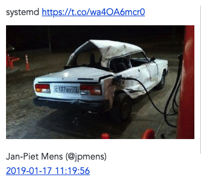

# jopleet

This program uses the [Joplin API](https://github.com/laurent22/joplin/blob/master/readme/api.md) and [Tweepy](http://docs.tweepy.org/en/latest/) to read individual Twitter status URLs, grab their text and images, and store them into new notes in a Joplin notebook.

1. Copy the example configuration file and create your own

   ```console
   $ copy jopleet.config.example jopleet.config
   ```

   Edit the file and fill in the values:

2. Open Joplin desktop (warning: tested on macOS only), open preferences and the _Web Clipper_ section. Enable the _Web Clipper Service_ which will make the REST API available.

3. In that same preference pane, under _Advanced Options_, you'll find the API authoriaation _token_. Copy this value into the value of `token` in your configuration file.

   ```ini
   token = xxxxxxxxxxxxxxxxxxxxxxxxxxxxxxxxxxxxxxxxxxxxxxxxxxxxxxxxxxxxxxxxxxxxxxxxxxxxxxxxxxxxxxxxxxxxxxxxxxxxxxxxxxxxxxxxxxxxxxxxxxxxxxxx
   ```

4. Create a Twitter dev account with the tokens you need. Their names are in the configuration file and you fill in the values accordingly.

5. Create a new notebook in Joplin into which _jopleet_ will store all tweets. We also call this a _folder_ -- in Joplin notebooks are called _folders_.

   ```console
   $ ./mk-folder.sh  a001
   {
    "title": "a001",
    "id": "491fea8acdb84ada8a766d9e17c3497e",
    "updated_time": 1602257565942,
    "created_time": 1602257565942,
    "user_updated_time": 1602257565942,
    "user_created_time": 1602257565942,
    "type_": 2
   }

6. Copy the value of `id` above, _without the double quotes_ into the value of `parent_folder =` in your configuration file.

   ```ini
   parent_folder = 491fea8acdb84ada8a766d9e17c3497e
   ```

7. Verify that the Markdown template in `jopleet.py` which will be written to each note is the way you want it to be; change accordingly.

8. Create the Python environment

   ```console
   $ python3 -mvenv env.v3
   $ env.v3/bin/pip install -r requirements

9. Test it

   ```console
   $ env.v3/bin/python ./jopleet.py https://twitter.com/jpmens/status/1085859260783837185
   ```

10. The result ought to be a note in Joplin which looks like this

   

